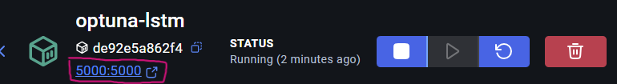

# LSTM + Optuna + MLflow

Projeto de experimentação automática com redes LSTM, utilizando **Optuna** para otimização de hiperparâmetros e **MLflow** para rastreamento de experimentos.

---

## Objetivo

Aplicar **modelos LSTM** em tarefas de séries temporais ou sequências, automatizando a busca de melhores configurações com **Optuna** e mantendo rastreabilidade e organização dos resultados com **MLflow**.

---

## Tecnologias

- [PyTorch](https://pytorch.org/)
- [Optuna](https://optuna.org/) – Otimização de hiperparâmetros
- [MLflow](https://mlflow.org/) – Gerenciamento de experimentos
- [Scikit-learn](https://scikit-learn.org/)
- [Pandas](https://pandas.pydata.org/)

---

## Estrutura do Projeto (Resumido)

```
├───data             # Pasta onde está os dados que serão utilizados.
│   ├───processed
│   └───raw
├───notebooks        # Notebooks de exploração.
├───src              # Arquivos de definição das rotinas.
└───main.py          # Arquivo para roda o código.
```
---

## Como rodar

### Sem Docker

#### 1. Clonar o repositório
```bash
git clone https://github.com/felipelapadn/LSTM-Optuna-MLFlow.git
cd LSTM-Optuna-MLFlow
```

#### 2. Criar e ativar ambiente virtual
```bash
python -m venv .venv
source .venv/bin/activate  # Windows: .venv\Scripts\activate
```

#### 3. Instalar dependências
```bash
pip install -r requirements.txt
```

#### 4. Iniciar o MLflow Tracking Server
```bash
mlflow server
# Acesse http://localhost:5000
```

#### 5. Executar otimização com Optuna
```bash
python main.py
```

### Com Docker
#### 1. Build da imagem Docker

Se preferir rodar manualmente:

```bash
docker build -t nome-da-imagem .
```

Ou usando o Makefile:

```bash
make docker
```

#### 2. Executar o container

Manual:

```bash
docker run -it nome-do-container
```

Ou via Makefile:

```bash
make run
```

#### Como proceder dentro do container

Dentro do container, é importante verificar a porta que está exposta. Caso você não tenha alterado nada no `Dockerfile`, a porta padrão será a **5000**.

Ao iniciar o container, você verá um cabeçalho semelhante a este:



**Atenção:** utilize o link circulado na imagem para acessar o MLflow. Embora o código ainda utilize o endereço padrão `http://localhost:[porta definida ao subir o container]`, o link correto será exibido diretamente no cabeçalho.

Tudo certo até aqui? Agora, acesse a aba `Exec` do container e execute o seguinte comando:

```bash
python main.py
```


#### 4. Parar e remover o container (se executado em modo background)

Manual:

```bash
docker stop nome-do-container
docker rm nome-do-container
```

Ou via Makefile:

```bash
make clean
```

## Como funciona

1. O **Optuna** define um conjunto de hiperparâmetros para teste (e.g. learning rate, número de camadas, tamanho do hidden).
2. A função objetivo:
   - constrói e treina o modelo LSTM com os parâmetros;
   - avalia o desempenho (MSE, RMSE);
   - faz log no MLflow com `mlflow.log_param()` e `mlflow.log_metric()`.
3. Os melhores modelos são salvos e registrados automaticamente.

## MLflow UI

Acesse `http://localhost:5000` para:

- Ver os experimentos com os parâmetros e métricas de cada trial;
- Comparar visualmente os resultados;
- Baixar o melhor modelo treinado como artefato.

## Autor

**Felipe Lapa do Nascimento** ([LinkedIn](https://www.linkedin.com/in/felipelapadn/) | [Email](mailto:felipelapadn@gmail.com)) 